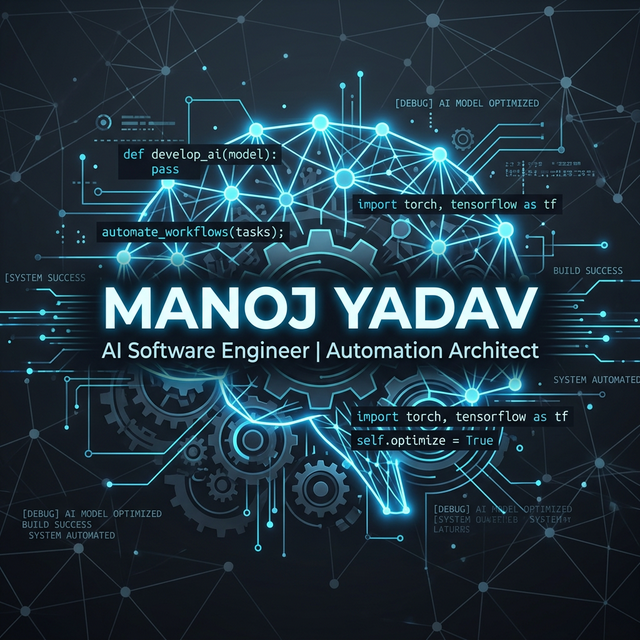

# Hi there 👋, I'm Manoj!

  

  

---

### 💻 About Me

I am an **AI Software Engineer & Automation Architect** focused on building intelligent systems and robust test automation frameworks. From **Local LLM integration** to **Playwright architectures**, I love building tools that automate the complex.

- 🤖 **Current Focus**: Local LLM Prompt Engineering & AI-driven Test Case Generation.
- 🚀 **Latest Project**: [n8n Daily Test Summary Reporter](https://github.com/Manoj8759/Project-10-N8N_Daily-Test-Execution-Summary-Reporter).
- 🛠️ **Expertise**: Selenium-to-Playwright migration, AI converters, and custom automation scripts.
- 💡 **Passion**: Simplifying the bridge between AI models and practical software engineering.
- 📫 **Reach me**: [LinkedIn Profile](https://www.linkedin.com/in/manoj-kumar-y-679a3959/)
- ⚡ **Goal**: Automating every repeatable task with AI!

---

### 🛠️ Tech Stack & Expertise

| Area | Technologies |
| :--- | :--- |
| **AI / LLM** | `Groq` `Kimi` `Local LLMs` `Prompt Engineering` |
| **Test Automation** | `Playwright` `Selenium` `Appium` `Postman` |
| **Workflow Automation** | `n8n` `GitHub Actions` `Jenkins` |
| **Languages** | `TypeScript` `JavaScript` `Java` `Python` `SQL` |
| **Concepts** | `Rice Pot Method` `SDET Patterns` `AI Frameworks` |

 

  

---

### 📊 GitHub Analytics

  
  

  

---

### 🌐 Connect with Me

  
  
  

---

  

